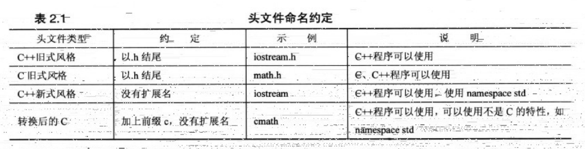
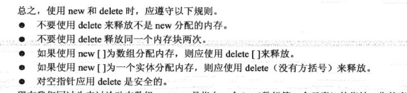

[toc]

# C++入门

这是C++基础知识，基于C++ Primer Plus 6Ed.


#第一章：预备知识

## C++程序创建技巧

下图是编程步骤，程序员编写`.cpp`文件的`源代码`，通过`GCC`等编译器编译生成`目标代码（object code，.o文件）`，将目标代码通过`链接程序`将`启动代码（startup code）`，和`库文件（.dll文件）`链接起来，然后生成`可执行文件（.exe文件）`


**GCC编译器案例：**

命令行编译`.cpp`文件。

`g++ -std=c++0x use_auto.cpp`


# 第二章：开始学习C++

## 2.1 main函数

```c++
int main()
{
	statements;
	return 0;
}
```

C++代码的`main`函数是作为程序运行的入口，一个项目肯定是以`main`函数为开始执行的入口的。相较于python代码，python是解释性语言，从任何的`.py`文件的开头开始顺序执行，到处都是入口。


## 2.2 预处理器和头文件

`#include <iostream>` :<font color="red">预编译指令</font>。在源代码被编译之前，用`<iostream>`替换或添加文本

C语言风格的头文件以`.h`结尾，如`math.h`。C++的风格则省略了扩展名`.h`。如下图：




## 2.3 名称空间namespace

如果使用了`#include <iostream>`，如果需要使用`iostream`中的程序，则需要使用名称空间`std`，通过下面的方式使用:

```c++
// 一次性使用全部名称空间的函数
using namespace std; 

// 使用名称空间的某个函数，就定义什么函数
using std::cout;
using std::cin;
using std::endl;
```

不同的名称空间中可能存在相同的程序名称，如：

```c++
Microflop::wanda("go dancing?");         // use namespace Microflop
Piscine::wanda("a fish named Desire");   // use namespace Piscine
```

## 2.4 赋值语句

赋值语句从右向左执行：

```c++
int yamaha, baldwin, steinway;
yamaha = baldwin = steinway = 88;

// 上述代码等价于
steinway = 88;
baldwin = steinway;
yamaha = baldwin;
```


## 2.5 输入语句

`cin`函数，在命令行输入一系列字符，根据变量的类型，自动转换为需要的类型。


# 第三章： 处理数据

## 3.1 变量类型

| 变量类型   | 名称                                                         |
| ---------- | ------------------------------------------------------------ |
| 整型       | short(2 bytes)，int(4 bytes)，long(4 bytes)，long long(8 bytes) |
| 无符号类型 | unsigned short/int/long/long long                            |
| 字符类型   | char/wchar_t/char16_t/char32_t                               |
| 有符号类型 | signed char/unsigned char: char类型本身既不是有符号，也不是无符号，自行定义 |
|            | bool is_ready = true/false;                                  |
| 常量类型   | const int toes = 10;                                         |
|            | float/double/long double                                     |
|            | auto i = 10;    // i是整型                                   |


`sizeof`函数，看看变量占多少个`bytes`，

`limits.h`或者`climits`如下图：


**cout.put()和cout.setf()**

`cout.put()`输出`char`字符；

`cout.setf()`输出

**#define与const比较，const的优点：**

1. const可以指定类型
2. 可以在函数内部定义，作用域灵活
3. 可以用于更加复杂的数据类型


## 3.2 C++算术运算

`+`，`-`，`*`：加，减，乘

`/`：如果是整型，则整除，不是则是普通的除，

`%`：求模运算


# 第四章： 复合类型

数组之所以被称为`复合类型`，是因为它是由其他类型来创建的(C语言使用“派生类型”)

## 4.1 数组


## 4.2 字符串

> C风格的字符串，和基于`string`类库的字符串。 

**C风格的字符串:**

```c++ 
char dog[8] = { 'b', 'e', 'a', 'u', 'x', ' ', 'I', 'I' };   \\ not a string, no '\0'
char cat[8] = { 'f', 'a', 't', 'e', 's', 's', 'a', '\0' };   \\ a string 
\\ '\0'是必须的，空字符是必须的
    
wchar_t title[] = L"abc";
char16_t name[] = u"ndifjid";
char32_t car[] = U"sjfkjdksfd";
// L, u, U分别是上述三者的前缀
```

**字符串读入：**

```c++
// 1.普通读入
const int arr_size = 20;
char name[20];
char dessert[arr_size];

cin >> name;

// 2.读入一行，使用getline()函数，读入数据直到换行
cin.getline(name, 20);    // name中有19个字符和1个空字符， getline读入时不包含换行符

// 3.cin.get()读入一行，包含换行符，读入两行中间需要增加一个cin.get()消除换行符的影响,如下
cin.get(name, arr_size);
cin.get();
cin.get(dessert, arr_size);

// 4. 空行和换行符的处理， 3中的第1,2两行可以合并为：
cin.get(name, arr_size).get();  // cin.get()返回的是cin对象，可以直接调用get()方法
// 或者:
(cin >> name).get();

```


## 4.3 string类

string类：

**赋值，拼接和附加:**

```c++
string str1, str2, str3;
str1 = "abc";  // 等式赋值
str2 = { "def" }  // 花括号赋值
// 拼接
str3 = str1 + str2
// 附加
str1 += str2
// C风格字符串和string类相加    
str1 += "abcdefg"
```


**C风格的操作字符串函数：**

需要引入`string.h`或者`cstring`。

```c++
#include <cstring>
strcpy(charr1, charr2);   // copy charr2 to charr1
strcat(charr1, charr2);   // charr1 += charr2
strlen(charr1);           // length of charr1
```


**string类成员函数：**

```c++
#include <string>
string str1 = "abcd";

len_str1 = str1.size()
```


## 4.4 结构体struct

```c++
// 定义结构体类型
struct inflatable
{
	char name[20];
    float volume;
    double price;
};

struct inflatable goose;  // c, require struct key word
inflatable goose;    // c++， omit struct key word

// 初始化参数

goose = {
    "Glorious Gloria",
    1.88,
    29.99
};

inflatable guest;
guest = goose;   // 成员赋值，对应的成员的值相等，可以

// 结构数组，即一个数组，数组的元素为结构体
inflatable gifts[100];
cout << "gifts 0' price is " << gifts[0].price << endl;
```


## 4.5 共用体union

共用体（union）是一种数据结构，他能够存储不同的数据类型，但同时只能存储其中一种类型。


## 4.6 枚举enum

C++的enum工具提供了另一种创建符号常量的方式，这种方式可以替代const， 它还允许定义新类型，但必须按严格的限制进行。

```c++
enum spectrum { red, orange, yellow, green, blue, violet, indigo, ultraviolet }

// spectrum 的枚举类型
spectrum band;
band = blue;   // band的赋值只能是上方的几种情况

```


## 4.7 指针和自由存储空间

> 指针名是用于存储值的地址，*运算符被称为间接值（indirect value）或者解除引用（dereferencing）运算符。
>
> 假设`manly`是一个指针，则`manly`表示一个地址，`*manly`表示存储在该地址处的值 

**指针类型：**

> 指针类型是指针所指向的值的数据类型
>
> int* ptr;  表示ptr所指向的地址存储的是整型数据

**指针最危险的地方：**

```c++
long* fellow;       // 创建了叫fellow的指针
*fellow = 223323;   // fellow所指向的地址存储223323
```

<font color="red">上述代码中，由于没有对`fellow`初始化，我们并不知道`fellow`的值，即我们不知道指针指向哪里，即我们不知道`223323`在内存中存储在哪个地方。</font>所以指针一定要初始化，给它指向一个合适的地址。

**数字和地址：**

```c++
int* pt;
pt = 0xB8000000;    // type mismatch, 16进制，看上去像一个地址，其实不是，在C语言中可以，在C++中不行

// 应对方法：应强制类型转换，将数字类型转换为适当的地址类型
pt = (int *) 0xB8000000;  // types match now
```


### 4.7.1 new分配内存和delete释放内存

> `new` 方法分配一个内存，是C++的方法，C语言使用库函数`malloc()`。
>
> `delete`方法在使用完内存后，将其释放。`delete ptr` 

在使用`new`方法分配内存时，分配一个<font color="red">没有命名的内存</font>，需要指定内存多少个字节，这根据所存储的数据类型来，如下：

```c++
int *pn = new int;  // new后面跟int表明分配一个用于存储int型数据的内容的内存，同时返回地址
                    // 同时pn指向new返回的地址
                    
// new的通用方法
typeName * pointer_name = new typeName;
```

在使用`delete`方法时，释放指针所指向的地址的内存。用法如下：

```c++
int* ps = new int;
// do something, use the memory allocated by new method
delete ps; // free the memory,释放内存，但是不删除指针，指针回到了没有赋值的状态，即没有指向任何内存，可以重新将其指向新的地址
```

*注：只能使用`delete`释放`new`分配的内存*


### 4.7.2 使用new撞见动态数组

>静态联编（static binding）：
>
>动态联编（dynamic binding）：

创建动态数组
```c++
int *psome = new int [10];  // 创建一个包含10个int元素的数组，psome指向该数组的第一个元素的地址
// delete释放内存
delete [] psome;
```




## 4.8 指针，数组，字符串和指针算术

```c++
double wages[3] = { 10000.0, 20000.0, 30000.0 };

double *pw = wages;  //或者 double *pw = &wages[0], 二者等价

pw += 1;    // 指针+1，指向的地址后移一位
*pw = wages[1];

// 指针和字符串
char animal[20] = "bear";
const char *bird = "wren";   // 将"wren"字符串的地址赋值给了bird指针
char *ps;
```

**new创建动态结构：**

```c++
inflatable *ps = new inflatable;    // 这里访问成员，的使用箭头成员运算符->

ps->price;  // 或者 (*ps).price
```

**存储：**

1. 自动存储:
2. 静态存储：`static double fee = 56.50;`
3. 动态存储:

## 4.9 数组的替代品vector类

 

# 第五章： 循环和关系表达式

## 5.1 C风格字符串比较

```c++
word == "mate";    // "mate"字符串常量表示的是地址，word变量名表示的也是地址，这样的比较不是字符串的比较，而是地址的比较。

char chr1[20], chr2[20];
// 如果两个相等，strcmp(chr1, chr2) = 0
// 如果chr1 < chr2，则strcmp(chr1, chr2) < 0
// 如果chr1 > chr2，则strcmp(chr1, chr2) > 0
```


## 5.2 时间`clock()`

```c++
#include <iostream>
#include <ctime>

using namespace std;

void waiting_some_time()
{
	cout << "Value of CLOCKS_PER_SEC is " << CLOCKS_PER_SEC << endl;  // 1000
	cout << "Enter the delay time, in seconds. \n";
	float secs;
	cin >> secs;
	clock_t delay = secs * CLOCKS_PER_SEC;  // CLOCKS_PER_SEC是每一秒执行的次数
	cout << "starting!!!\n";
	clock_t start_time = clock();
	cout << "start time is " << start_time << endl;
	while (clock() - start_time < delay)
	{
		;
	}
	cout << "Done! and now time is " << clock() << endl;
}
```


# 第六章： 分支语句和逻辑运算符

## 6.1字符函数库cctype

```c++
#include <cctype> // 或者#include<ctype.h>

isalpha(ch) // 是字母，则返回非0的值，否则返回0，
ispunct(ch) // 是标点则返回true
isdigits(ch)  // 是否为数字
isspace(ch)    // 是否为空白，如换行符，空格和制表符

```


## 6.2 简单的文件输入/输出

```c++
#include <fstream>
std::ofstream   // fstream中定义了ofstream的类
    
#include <iostream>
#include <fstream>

using namespace std;
void writeToTxt() {
	ofstream outFile, fout;   // outFile 现在和cout的功能一样，将数据写入文档
	outFile.open("carinfo.txt");

	char automobile[50];
	int year;
	double a_price;
	double d_price;

	cout << "Enter the make and model of automobile: ";
	cin.getline(automobile, 50);
	cout << "Enter the model year: ";
	cin >> year;
	cout << "Enter the original asking price: ";
	cin >> a_price;
	d_price = 0.913 * a_price;

	// display info with outFile
	outFile << fixed;
	outFile.precision(2);
	outFile.setf(ios_base::showpoint);
	outFile << "Make and model: " << automobile << endl;
	outFile << "Year: " << year << endl;
	outFile << "Was asking $" << a_price << endl;
	outFile << "Now asking $" << d_price << endl;
	outFile.close();

}
// 该程序类似于python中的文件读取
f = open('carinfo.txt', mode='r')
f.write('xxxx')
f.close()
```


```c++
// 从文件中读入数据
#include <iostream>
#include <fstream>  // write/read from file, such as txt

#include <cstdlib>

using namespace std;

const int SIZE = 60;

void readFromTxt()
{
	char filename[SIZE];
	ifstream inFile;    // 读取，和ofstream
	
	cout << "Enter name of data file: ";
	cin.getline(filename, SIZE);
	cout << "filename is: " << filename << endl;

	// inFile.open(filename);
	inFile.open("..\\scores.txt");   // 从该.cpp文件到file的相对路径
	if (!inFile.is_open())
	{
		cout << "Could not open the file " << filename << endl;
		cout << "Program terminating.\n";
		exit(EXIT_FAILURE);   // EXIT_SUCCESS
	}
	double value, sum = 0.0;
	int count = 0;

	inFile >> value;    // get first value
	while (inFile.good())   // while input good and not at EOF
	{
		++count;
		sum += value;
		cout << value << endl;
		inFile >> value;
	}
	if (inFile.eof())
	{
		cout << "End of file reached.\n";
	}
	else if (inFile.fail())
	{
		cout << "Input terminated by data mismatch.\n";
	}
	else
	{
		cout << "Input terminated for unknown reason.\n";
	}

	if (count == 0) {
		cout << "No data processed.\n";
	}
	else {
		cout << "Items read: " << count << endl;
		cout << "Sum: " << sum << endl;
		cout << "Average: " << sum / count << endl;
	}
	inFile.close();     // finished with the file

}
```


# 第七章： 函数

## 7.1 函数申明

函数需要在使用前申明

```c++
void cheers(int a);
double cube(double x);
int max(int a, int b);  // int max(int, int);
// 上述三个都是原型prototype。变量名可以省略
```


## 7.2 函数与数组、二维数组、字符串、结构体、string对象和array对象

### 7.2.1 数组和二维数组

```c++
#include <iostream>
#include <cstring>

using namespace std;
const int ArSize = 8;

int sum_arr(int arr[], int n);

void arrfun() {
	int cookies[ArSize] = { 1,2,4,8,16,32,64,128 };
	cout << cookies << " = array address, ";
	cout << sizeof cookies << " = sizeof cookies\n";  
	// sizeof cookies = 32, 表示整数数组所占字节数
	int sum = sum_arr(cookies, ArSize);
	cout << "Total cookies eaten: " << sum << endl;
	sum = sum_arr(cookies, 3);
	cout << "First three eaters ate " << sum << "cookies.\n";
}

int sum_arr(int arr[], int n)
{
    // arr是传入的数组的指针
    // 如果不允许该函数改动cookies，则定义const int arr[]，不能指定长度
    // 都是对cookies进行操作，而不是复制一份
	int total = 0;
	cout << arr << " = arr, ";
	cout << sizeof arr << " = sizeof arr\n";
	// size of arr = 4, 表示指针变量所占字节数
	for (int i = 0; i < n; i++) {
		total += arr[i];
	}
	return total;
}
```

指针和数组

```c++
int sum_arr(const int *ptr, int n);
// 区别常量指针和指向常量的指针
// 常量指针：禁止修改指针指向的位置
// 指向常量的指针：不能修改指针所指向的值
```

### 7.2.2 函数返回C风格字符串

```c++
#include <iostream>

using namespace std;
char* buildStr(char c, int n);

void returnStr() {
	int times;
	char ch;

	cout << "Enter a character: ";
	cin >> ch;

	cout << "Enter an integer: ";
	cin >> times;

	char* ps = buildStr(ch, times);  
	// ch = 'h', times = 10
	// ps = { 'h', 'h', 'h', 'h', 'h', 'h', 'h', 'h', 'h', 'h'}

	cout << "pointer ps's address: " << ps << endl;
	delete[] ps;

	cout << "Error Code!" << endl;

	char* pts = buildStr('b', 20);
	cout << pts << "-DONE-" << pts << endl;
	delete[] pts;   // free memory
}


char* buildStr(char c, int n) {
	char* pstr = new char[n + 1];
	pstr[n] = '\0';   // 必须以'\0'结尾，不然报错
	while (n-- > 0) {
		pstr[n] = c;
	}
	return pstr;  
    // new新分配内存，然后返回指向该内存的指针
}
```


### 7.2.3 函数和结构体


## 7.3 指针函数

申明普通函数:

```c++
double pam(int);
```

申明指针函数：

```c++
double (*pf)(int);
// pf是指向该函数代码的开始的地址的指针
// 注意以返回指针的函数进行区别
double *pf(int);
// 表示函数名为pf， 参数为int的函数，其返回参数是一个指针

// 在正确声明了函数指针后，要赋值
pf = pam;
```


案例：

```c++
double pam(int);
double (*pf)(int);
pf = pam;  // 赋值
double x = pam(4);
double y = (*pf)(4); // 调用指针函数

double y = pf(4); // c++中这样调用也是可以的

```


# 第八章：函数探幽

## 8.1 内联函数

`inline`关键字申明的函数，比常规函数节省时间，但是会耗费空间。

```c++
inline double square(double x) {return x * x}
// 函数内容很短，但是需要反复调用，为了节约反复调用的时间，则将此函数内嵌到调用的地方，节约调用的时间。
// 内联函数在声明的时候，需要直接将函数写完整
```

**C风格的内联：**

使用`#define`来实现。

```c++
#define SQUARE(x) x * x;  //此处不是参数传递实现，而是“文本替换”实现
```


## 8.2 引用变量


## 8.3 默认参数和函数重载

函数类型和函数参数列表总体构成——**函数特征标(function signature)**，函数特征标不同，才能重载。

在函数执行相同功能，但是使用不同参数时使用


## 8.4 函数模板

```c++
#include <iostream>

using namespace std;

template <typename T>   // 或者class T
void Swap(T& a, T& b);

void funcTemplate() {
	int i = 10, j = 20;
	cout << "i, j = " << i << ", " << j << ".\n";
	cout << "Using compiler-generated int swapper: \n";
	Swap(i, j);   // generates void Swap(int &, int &)
	cout << "Now i, j = " << i << ", " << j << ".\n";

	double x = 24.5;
	double y = 81.7;
	cout << "x, y = " << x << ". " << y << ".\n";
	cout << "Using compiler-generated double swapper:\n";
	Swap(x, y);
	cout << "Now x, y = " << x << ", " << y << ".\n";
}

template <typename T>
void Swap(T& a, T& b) {
	T temp;
	temp = a;
	a = b;
	b = temp;
}
```


# 第十章： 对象和类

## 10.1 C++类的使用案例

```c++
// head file
#include <string>

class Stock
{
private:
	std::string company;
	long shares;
	double share_val;
	double total_val;
	void set_tot() { total_val = shares * share_val; }
public:
	Stock();   // 默认构造函数
	Stock(const std::string& co, long n, double pr = 0.0);
	~Stock();   // noisy destructor 析构函数

	void buy(long num, double price);
	void sell(long num, double price);
	void update(double price);
	void show();
};

// 类的实现文件
#include <iostream>
#include "../head_file/stock10.h"

Stock::Stock() {  
	// 默认构造函数
	std::cout << "Default constructor called.\n";
	company = "no name";
	shares = 0;
	share_val = 0.0;
	total_val = 0.0;
}

Stock::Stock(const std::string& co, long n, double pr) {
	// 带参数的构造函数
	std::cout << "Constructor using " << co << "called\n";
	company = co;
	
	if (n < 0) {
		std::cout << "Number of shares can not be negative; "
			<< company << "shares set to 0.\n";
		shares = 0;
	}
	else {
		shares = n;
	}
	share_val = pr;
	set_tot();  // 调用构造函数中的内联函数
}

// 析构函数
Stock::~Stock() {
	std::cout << "Bye, " << company << "!\n";
}

void Stock::buy(long num, double pr) {
	if (num < 0) {
		std::cout << "Number of shares purchased can't be negative. "
			<< "Transaction is aborted.\n";
	}
	else
	{
		shares += num;
		share_val = pr;
		set_tot();
	}
}

void Stock::sell(long n, double p) {
	if (n < 0) {
		std::cout << "Number of shares purchased can't be negative. "
			<< "Transaction is aborted.\n";
	}
	else if (n > shares) {
		std::cout << "You can't sell more than you have! "
			<< "Transaction is aborted.\n";
	}
	else
	{
		shares -= n;
		share_val = p;
		set_tot();
	}
}

void Stock::show() {
	std::ios_base::fmtflags orig = std::cout.setf(std::ios_base::fixed, std::ios_base::floatfield);
	std::streamsize prec = std::cout.precision(3);  // set format to #.###

	std::cout << "Company: " << company << "  Shares: " << shares;
	std::cout << "  Share Price: $" << share_val << std::endl;

	std::cout.precision(2);  // set format to #.##
	std::cout << "Total Worth: $" << total_val << std::endl;;

	// restore original format
	std::cout.setf(orig, std::ios_base::floatfield);
	std::cout.precision(prec);
}

void Stock::update(double pr) {
	share_val = pr;
	set_tot();
}


// 客户端文件，即使用类的文件 
#include <iostream>
#include "../head_file/stock10.h"

using namespace std;

void useStock() {
	Stock stock1 = { "NanoSmart", 12, 20.0 };
	Stock stock2("Boffo Objects", 2, 2.0);
	Stock st = { "tmp", 10, 4 };
	Stock stock3 = Stock{ "Derivatives Plus Plus", 100, 45.0 };
	Stock temp;

	cout << "no-initialized instance:" << endl;
	temp.show();

	cout << "initialize stock1" << endl;
	stock1.show();

	cout << "initialize stock2" << endl;
	stock2.show();

	cout << "initialize stock3" << endl;
	stock3.show();

	temp = stock1;
	stock1 = stock2;
	stock2 = temp;
	cout << "show stock1:" << endl;
	stock1.show();

	cout << "show stock2:" << endl;
	stock2.show();
	// 代码结束后析构是按照 temp -> stock3 -> st -> stock2 -> stock1的顺序

}

```


**常量class:**

```c++
const Stock stock1;
stock.show();  // 次数使用时，需要show方法不能改变类，其也是const的

// show方法的声明和定义
void show() const;
void Stock::show() const;   // const放在后面
```


# 第十一章： 使用类：友元和重载


