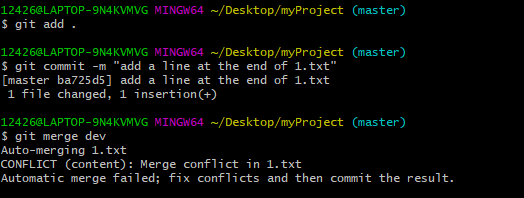

[TOC]

## 常用命令

### git clone

含义：从GitHub等代码托管平台克隆别人的项目

用法：`git clone [url]`

步骤：

1. 打开GitHub并找到你需要的项目

2. 点击`Clone or Download`，选择`Clone with SSH`或者`Clone with HTTPS`

   如图：

3. 在git-bash中输入如下命令：`git clone git@github.com:dujinyu/faker.js.git`即可克隆该项目到本地。

4. 当然你也可以选择`Use HTTPS`的方式，或者`Download ZIP`,看你想用那种方式。

### git init

含义：将一个文件夹初始化为一个Git仓库

用法：`git init [project-name]`

用法详解：

​	**法一**、你可以在你想要的地方，创建一个工作文件夹或者已存在的文件夹，然后进入到该文件夹，执行命令`git init`，既初始化完成。初始化完成后，会在该文件夹中生成一个名为`.git`的隐藏文件，看着就好，一定一定一定不要动它。

​	**法二**、直接执行命令`git init myProject`，这样会创建名字叫`myProject`的文件夹，并将其初始化。初始化完成后，会在该文件夹中生成一个名为`.git`的隐藏文件，看着就好，一定一定一定不要动它。

如图：

初始化如下：

隐藏文件如下：

### git status

含义： 查看**工作区**和**暂存区**当前状态

用法： `git status`

图示：

 

红色部分是存在于**工作区**的内容，绿色部分是存在于**暂存区**的内容。

### git add

含义：将工作区的内容放到暂存区

用法：`git add [filename]`

用法详解：

​	如**git status**中的图示，我们想要将`2.txt`从工作区加入到暂存区，可以执行命令`git add 2.txt`，如果工作区有很多文件有待加入暂存区，我么为了一次操作全部加入，则可以执行命令`git add .`，有一个**点**。

### git commit

含义：将**暂存区**中的内容放入**仓库区**

用法：`git commit -m 'descriptive message'`

用法详解：`descriptive message`是对你将要加入仓库区的内容的一个描述，描述你这里面都做了哪些改动。需要用**双引号或单引号**引起来。`-m`是`--message`的意思，二者一致。如果不添加该参数，则会在`commit`执行是跳到`vi`编辑器中添加。`vi`编辑器请另行百度。

### git log

含义：查看`commit`的提交日志。

用法：`git log`

用法详情：如图，一长串黄色数字是唯一的标识。可以看到每一次提交。可以带参数

`--pretty=oneline`，每个提交日志一行显示。

更加详细的使用方式请看链接：[git log详细用法](http://www.cnblogs.com/bellkosmos/p/5923439.html)

### git reset

含义：将暂存区的内容取消暂存，退回到工作区，保存暂存前的改动。

用法：`git reset HEAD filename`或`git reset filename`

用法详解：如下图，文件`2.txt`已经被加入到暂存区，我们可以执行`git reset HEAD 2.txt `来取消暂存`unstage`，该文件重新回到工作区。

取消暂存后的效果图：

**版本回退**：在上述看到提交日志。我们可以回到过去，回到任何的一次`commit`的版本。

命令如下：

​	回到上一个版本：`git reset --hard HEAD^`，`^`出现一次就往过去回退一个版本。

​	回到任意版本：`git reset --hard xxxxxxx`，其中`xxxxxxx`是版本号，即日志中的那一长串字符。取其前几位即可。

​	**补充**：`git reflog`可以查看所有带版本号的`commit`。应为回到之前的版本，用`git log`看不到该版本之后的提交日志。在忘记版本号后，可以使用该命令查看版本号。

### git branch

含义：列出当前仓库的所有分支

用法： `git branch`

用法详解：

​	创建分支：`git branch branchName`，如下图，创建了`dev`开发分支，当前处于`master`分支。

​	查看分支：`git branch`

​	删除分支：`git branch -d dev`，带参数`-d`，删除`dev`分支。

​	如下图：

### git checkout

含义：从当前分支切换到目的分支

用法：`git checkout branchName`

用法详解：

​	如下图，可以看到我们已经从`master`分支切换到了`dev`分支。

​	**Tips**:`git checkout -b branchName`：带`-b`参数，表示创建并切换至`branchName`分支。

### git diff

含义：比较尚未被暂存的文件和其他文件的区别，显示在gitbash上

用法：`git diff`

用法详解：

​	**法一**、直接`git diff`，就和**含义**表明的一样。如下图，比较了工作区和上次的版本的不同。`+`号表示增加，`-`表示删除。对于暂存区中的内容，为白色部分。

​	**法二**、对某一个文件比较差异。命令为：`git diff filename`。

​	**注意**：对于`Untracked files`，这条命令不起作用，需要用`git add filename`进行`track`，即将该文件纳入`git`的版本管理。

​	**法三**、命令：`git diff --staged [filename]`，对比暂存区的的文件和最后一次版本的文件比较。

### git merge

含义：将其他分支合并到当前分支

用法：`git merge [branch-name]`

用法详解：加入我们将`master`分支的内容，`merge`融合到`dev`分支上。我们则需要`git checkout dev`切换分支到`dev`上，然后执行命令`git merge master`。如下图：

原本`dev`分支上只有`1.txt`，在执行`merge`后，多出了`2.txt,3.txt`。这时候`master`分支的内容就被放到`dev`上了，这里没有出现`merge`冲突的情况。如果出现，需要手动处理。

​	**merge冲突**：如下图，在将`dev`分支合并到`master`分支时出现了`conflict`。

在冲突的文件中会出现下列内容：

解决方法：

 	1. 手动解决冲突部分，就是手动删除`<<<<<<< HEAD`，`=======`，`>>>>>>> dev`。
 	2. 调整冲突部分为你想要的顺序，上述被删除部分是提示你冲突在哪里。
 	3. 执行`git add 冲突文件`，`git commit -m "descriptive message"`。冲突到此已被解决。

**额外**：`git ls-files -s`用来显示冲突的文件有哪些，看第二列数字。

1. 如果为0表示对应的文件没有冲突，合并成功。
2. 如果不为0，则表示产生了合并的冲突，其中具体的值对应的意义是：`1`表示两个用户之前一个共同版本的对应文件内容；`2`表示当前用户对应的文件版本；`3`表示合并后的文件对应的远程版本

`git show :n:filename`，`n`对应上述的`1,2,3`，`filename`对应冲突的文件名。

**树冲突**，即两个人因改动同一文件的文件名而产生的冲突，以及更过**merge**问题，请参看链接：

[https://blog.csdn.net/qq_27905183/article/details/78575247](https://blog.csdn.net/qq_27905183/article/details/78575247)

