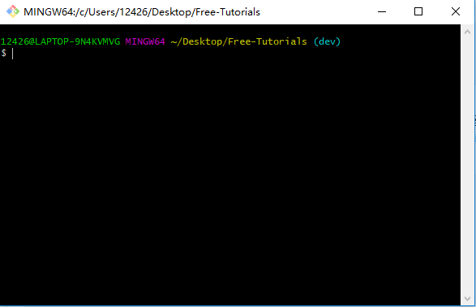
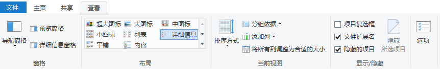
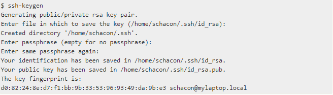
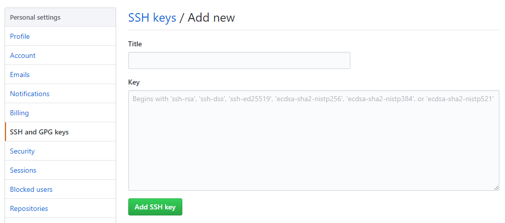

[TOC]

# Git教程

## git下载及安装配置

### git for Windows10

1. **下载**

   下载地址：[git官网](https://www.git-scm.com/)

   根据电脑位数(32位或64位)下载相应位数软件(一般软件x86是32位，x64是64位，这里不涉及)

2. **安装**

   Windows10下直接点击安装，注意安装位置，和相应环境变量的添加。查看环境变量位置：此电脑 --> 右键属性 --> 高级系统设置 --> 高级：环境变量 --> 用户变量或者系统变量中的PATH

3. **配置**

   官方文档：[配置 Git](https://git-scm.com/book/zh/v1/%E8%87%AA%E5%AE%9A%E4%B9%89-Git-%E9%85%8D%E7%BD%AE-Git)

   + 不做任何配置，已经可以在自己的电脑上使用了。

   + 如果要在例如**github**等代码托管平台托管代码，那么需要以下步骤：

     1. 登录[github官网](https://github.com/)注册自己的账号，记住账号和密码

     2. 在桌面右键，点击"Git Bash Here"，GUI不用管。界面如下：

     3. 添加刚刚在GitHub上注册到的邮箱和用户名，可以使用`git config --list`查看config配置信息。添加信息代码如下：

        ```bash
        # 全局配置用户名和密码，加上--global参数
        git config --global user.name "John Doe"
        git config --global user.email "johndoe@example.com" 
        ```

        你可以在你的电脑的C盘 --> 用户(Users) --> 自己正在使用的用户目录下看到一个名为`.gitconfig`的文件，由于是隐藏文件，你可以点击左上角“**查看**”，勾选右侧“**隐藏的项目**”，如图：你可以点击查看你的全局配置信息

     4. 现在还没结束呢，还有最后但最关键的一步，让你的本地电脑和GitHub上的账号彼此知道彼此，建立一个只有彼此知道加密方式，放心“传纸条”，不让别人看到内容。我们要在本地生成`SSH`公钥，复制粘贴到github上。

        + 生成公钥：打开git-bash，输入命令`ssh-keygen`。如下图：
        + 在刚才找到`.gitconfig`的目录下，可以找到`.ssh`文件夹，可以在里面看到存在名字叫`id_rsa`和`id_rsa.pub`的两个文件。这就是**RSA**加密生成的私钥和公钥。
        + 打开`id_rsa.pub`文件，将其中的内容“一串字符”，复制。
        + 打开GitHub --> 登录 --> 点击右上角头像 --> 点击Settings --> 点击左边竖栏中"SSH and GPG keys" --> 点击右上角绿色的按钮"New SSH key",给这个key起一个`Title`,然后将上一步复制的内容添加到`Key`中，随后点击"Add SSH key".如图：
        + OK,大功告成。

## 常用命令

#### 


